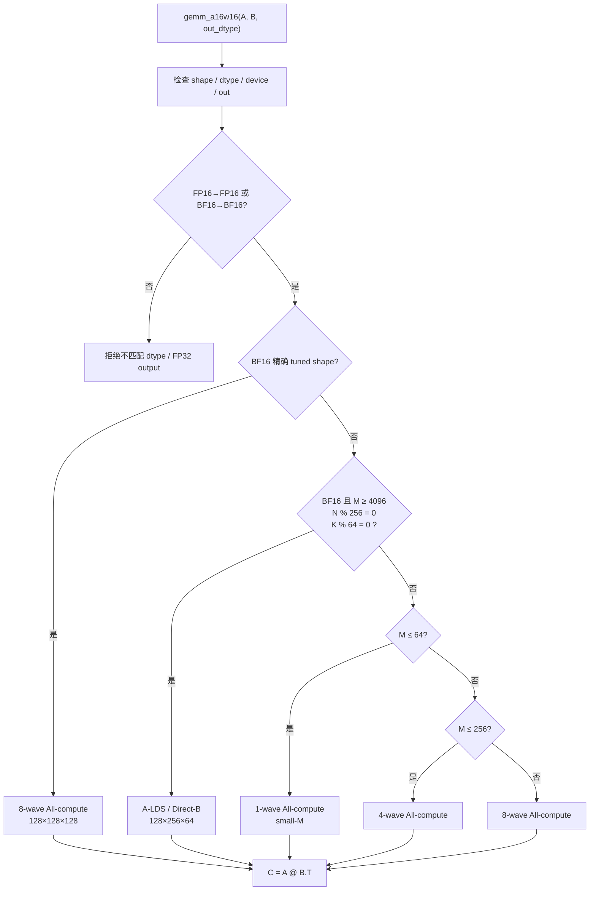
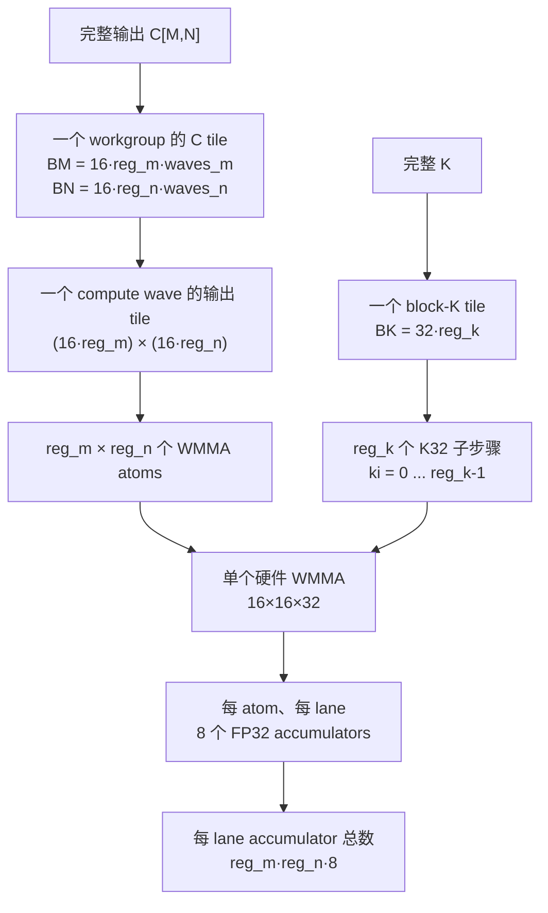
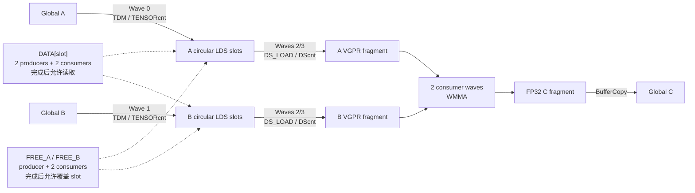
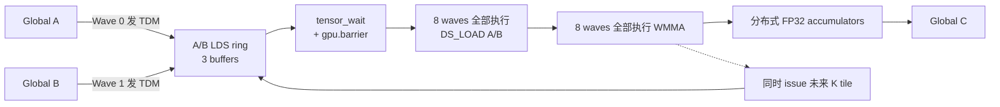
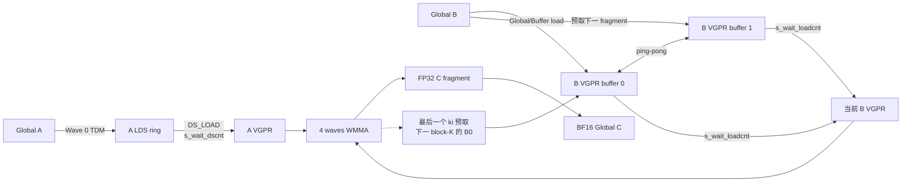
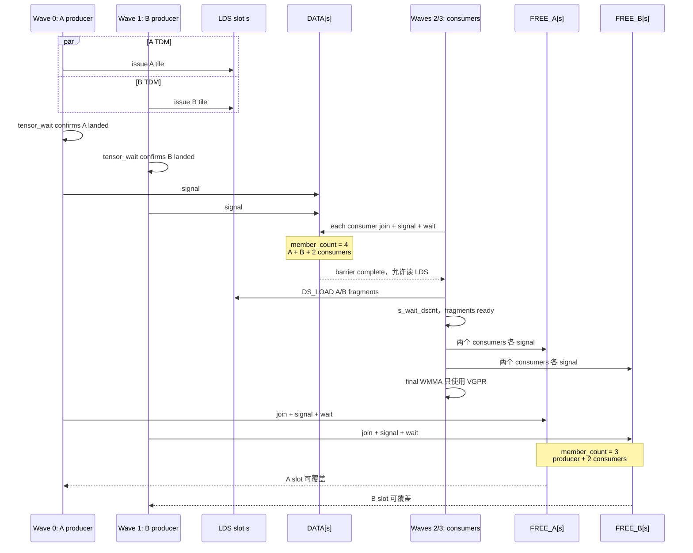
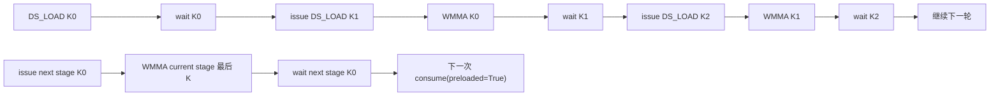
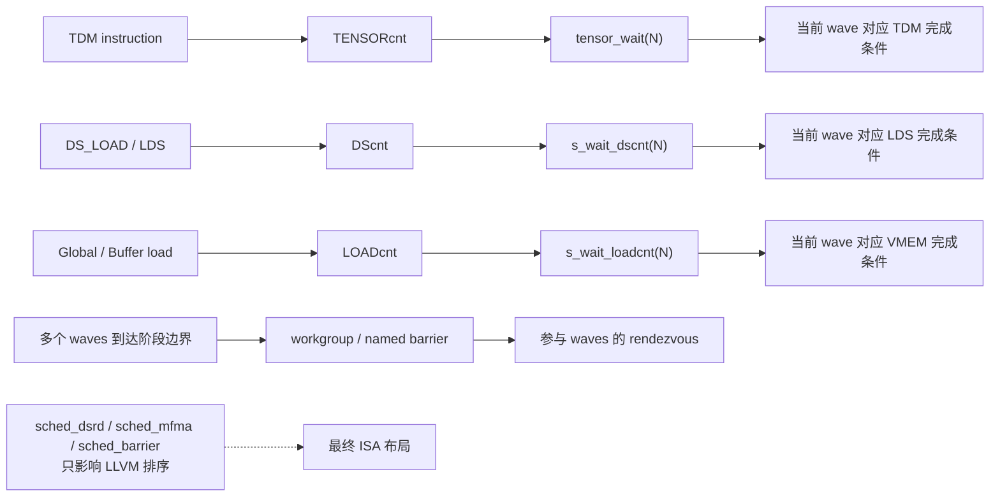

# gfx1250 A16W16 GEMM：从读懂 Kernel 到独立优化

本文对应 2026-08-20 收敛后的 gfx1250 A16W16 实现。生产入口已经统一为
role-fused all-compute family：

- `kernels/gemm_a16w16_gfx1250.py`：轻量公共入口；
- `kernels/gemm_a16w16_gfx1250_all_compute.py`：1/2/4/8-wave 生产实现；
- `kernels/gemm_a16w16_gfx1250_producer_consumer_reference.py`：仅供学习的历史备份。

生产接口只支持 FP16→FP16 与 BF16→BF16。任意 M/N/K 通过 wrapper padding
进入 all-compute；BF16 的部分精确 shape 使用 tuned 8-wave 或 direct-B。

源码后续变化时，应优先按函数名定位，文中的行号只作为当前版本索引。

仓库中的 benchmark/optimization notes 包含历史实验，其中部分“current
source hash”和旧 producer/consumer dispatch 描述已经落后于当前实现。
开始新一轮优化前必须对当前源码重新建立 baseline，不能直接把历史
数字当作当前 route 的性能。

---

## 1. 先明确学习目标

读完本文后，应当能够回答并实际验证下面的问题：

1. 给定 `(M,N,K,dtype,out_dtype)`，公共接口会选择哪条路由？
2. 一个 workgroup 计算多大的 C tile？每个 wave 和 lane 拥有哪些 accumulator？
3. A、B 分别经过 Global、GL2/GL1、TDM、LDS、VGPR 的哪条路径？
4. 每个 `tensor_wait`、`s_wait_dscnt` 和 `gpu.barrier` 在保护什么不变量？
5. 修改 `reg_m/reg_n/reg_k` 后，WMMA 数量、VGPR、LDS、TDM request 和 grid occupancy 如何变化？
6. 为什么 small-M 使用 1 wave，而中/大 M 使用 8-wave 或 direct-B？
7. 如何判断瓶颈是 grid underfill、VGPR/LDS occupancy、LDS feed、TDM、GL2/HBM、指令调度、instruction fetch，还是功耗降频？
8. 如何在修改后证明结果正确、没有偶发 race，并确认最终 ISA 真正发生了预期变化？

优化的核心原则是：

> 一次只改变一个可以被测量的假设；先证明正确，再比较时间，再用 counter 和 ISA 解释时间。

---

## 2. 源码阅读地图

当前生产实现按下面顺序阅读。

### 2.1 公共入口：`gemm_a16w16_gfx1250.py`

- 仅 re-export production all-compute API；
- producer/consumer 不再进入 production import graph。

### 2.2 Kernel factory：`gemm_a16w16_gfx1250_all_compute.py:24–561`

- `_create_all_compute_module()`；
- 1/2/4/8 个 wave 全部拥有 accumulator 并执行 WMMA；
- 普通 A/B-TDM-to-LDS 路径；
- A-LDS/direct-B-to-VGPR 路径；
- XCD remap；
- prologue/steady-state/epilogue buffer pipeline。

### 2.3 Cache 与 wrapper：`gemm_a16w16_gfx1250_all_compute.py:563–758`

- `_cached_all_compute_module()`；
- M/N/K padding 与 contiguous materialization；
- 首次 compile/dispatch 的锁；
- FP16/BF16 matching-output validation。

### 2.4 Dispatch policy：`gemm_a16w16_gfx1250_all_compute.py:760–879`

- `_BF16_EXACT_CONFIGS`；
- `_DIRECT_B_CONFIG`；
- `_select_all_compute_config()`；
- `gemm_a16w16()`。

### 2.5 历史参考

`gemm_a16w16_gfx1250_producer_consumer_reference.py` 原样保留 dedicated
producer waves、named barriers 和 circular DATA/FREE pipeline。后文
producer/consumer 章节用于学习，不代表当前 production dispatch。

---

## 图解总览：先用图建立心智模型

建议先看完本节的图，再进入后面的逐段解释。图中的实线表示数据或执行顺序，
虚线表示同步/控制关系。

更适合交互查看各 all-compute 配置和历史 producer route 的版本见
[gfx1250 GEMM 学习地图](/home/xiaobizh/.cursor/projects/home-xiaobizh/canvases/gfx1250-gemm-optimization-guide.canvas.tsx)。

### 图 1：公共接口如何选择 route



读图重点：

- route 是按 dtype 和 shape 选择的，不是运行过程中动态切换；
- FP16 与 BF16 都只走 all-compute，wrapper 负责任意 M/N/K padding；
- FP32 output 不再属于 production API；
- producer/consumer 仅保存在历史参考文件中。

### 图 2：矩阵如何逐层分解为 WMMA



以 direct-B 配置为例：

```text
reg_m=8, reg_n=4, reg_k=2, waves=1x4
BMxBNxBK = 128x256x64
每 wave 每个 K32 执行 8x4 = 32 条 WMMA
每 lane 持有 8x4x8 = 256 个 FP32 accumulators
```

### 图 3：生产与历史参考的数据路径

#### 3A. Producer/consumer（历史学习参考，不参与 production）



#### 3B. 8-wave all-compute



#### 3C. A-LDS / Direct-B



读图重点：

- producer/consumer 和 all-compute 都让 A/B 经过 LDS；
- direct-B 只让 A 经过 LDS，B 使用独立 `LOADcnt`；
- direct-B 不是“无 LDS kernel”，它仍有 A LDS 和刻意保留的 B LDS reservation。

### 图 4：Producer/consumer 的一个 slot 如何交接



这张图解释了为什么 FREE 可以在 final WMMA 前 signal：最后一次 WMMA 已经
不再读 LDS，只读 VGPR。

### 图 5：三 stage circular pipeline

```mermaid
flowchart LR
    PRO["Prologue"] --> P0["issue K0 → slot 0"]
    P0 --> P1["issue K1 → slot 1"]
    P1 --> P2["issue K2 → slot 2"]
    P2 --> D0["K0 ready<br/>publish DATA0"]

    D0 --> S0["wait FREE0<br/>issue K3 → slot 0"]
    S0 --> D1["K1 ready<br/>publish DATA1"]
    D1 --> S1["wait FREE1<br/>issue K4 → slot 1"]
    S1 --> D2["K2 ready<br/>publish DATA2"]
    D2 --> S2["wait FREE2<br/>issue K5 → slot 2"]
    S2 --> LOOP["继续循环<br/>slot 0 → 1 → 2 → 0"]

    LOOP --> TAIL["Epilogue<br/>tensor_wait(0)<br/>发布最后 pending slots"]
```



物理上始终只有三个 slots，逻辑 K tiles 不断覆盖它们：

```text
slot 0: K0 → K3 → K6 → ...
slot 1: K1 → K4 → K7 → ...
slot 2: K2 → K5 → K8 → ...
```

### 图 6：`cross` 模式如何重叠 LDS read 与 WMMA



这里不是让同一 wave 在同一 cycle 同时 issue DS 和 WMMA，而是把 long-latency
DS read 提前，让当前 WMMA 的执行时间覆盖一部分 LDS latency。

### 图 7：每种同步操作究竟等待什么



不能互相替代：

```text
barrier complete      ≠ TDM 一定完成
tensor_wait complete  ≠ 其他 wave 已到达
sched_barrier         ≠ 任何 runtime wait
```

---

## 3. 数学契约与物理数据布局

kernel 计算：

```text
C[M,N] = A[M,K] @ B[N,K].T
```

也就是：

```text
C[m,n] = sum(k, A[m,k] * B[n,k])
```

输入 B 的物理 shape 是 `[N,K]`，而不是常见 BLAS 接口里的 `[K,N]`。源码中的 `arg_bt` 表示它在数学上作为转置后的 B 使用，并不表示 wrapper 在调用前真的执行了一个 GPU transpose kernel。

支持的输入：

- A 和 B 都必须是二维；
- A、B 的 K 必须相同；
- 输入必须同 dtype；
- 输入 dtype 为 FP16 或 BF16；
- 输出可为 FP16、BF16 或 FP32；
- 累加始终使用 FP32；
- A、B 必须位于同一 AMD GPU。

该 kernel 不实现 bias、alpha/beta、activation 或 split-K reduction。

---

## 4. CDNA5/gfx1250 硬件模型

本节基于 AMD 2026-07-27 发布的
[CDNA5 Instruction Set Architecture Reference Guide](https://www.amd.com/content/dam/amd/en/documents/instinct-tech-docs/instruction-set-architectures/amd-instinct-cdna5-instruction-set-architecture.pdf)。
它是解释本 kernel 的硬件依据，而不是把 gfx950/CDNA4 的 wave64 规则套到
gfx1250。该 ISA 明确说明：CDNA5 设备只支持 wave32。

推荐重点阅读官方文档中的：

- 硬件与 wave 概念：第 3–20 页；
- barrier、依赖计数器和软件调度：第 45–58 页；
- WMMA 与寄存器映射：第 94–107 页；
- TDM：第 139–147 页；
- LDS：第 148–155 页。

### 4.1 Grid → workgroup → wave → lane

- Dispatch 启动 1D/2D/3D grid；
- workgroup 对应 CUDA block；
- workgroup 是能够共享 LDS、使用 barrier 同步的一组 waves；
- wave 固定包含 32 个 work-items；
- lane/thread/work-item 在本文上下文中表示同一层级；
- `tid // 32` 得到 workgroup 内 wave 编号；
- `readfirstlane()` 把值明确变成 wave-uniform scalar。

WMMA、TDM 和 scalar barrier 指令是 wave 级行为。虽然源码看起来由 32 个
Python“线程”执行，同一 wave 的 scalar 指令实际上只产生一次 wave 级硬件操作。

### 4.2 WGP、CU 和 SIMD32

CDNA5 ISA 的硬件术语：

```text
1 WGP = 4 SIMD32
1 CU  = 半个 WGP = 2 SIMD32
```

一个 workgroup 的所有 waves 都调度在同一个 WGP，但可以分布到该 WGP 的
四个 SIMD32。一个 workgroup 最多 1024 work-items，即最多 32 个 wave32。
WGP 最多同时容纳 32 个 workgroups，实际数量通常先受 LDS、VGPR 和 wave
资源限制。

当前 MI455/gfx1250 机器由 `amd-smi` 报告 256 CUs。按 ISA 的 CU/WGP 定义，
对应 128 个 WGP。优化 occupancy 时应区分：

```text
workgroup 空间覆盖  → 与约 128 个 WGP 比较
wave issue/residency → 与每 WGP 的 4 个 SIMD32 比较
设备规格/计数器     → 可能仍以 256 个 CU 报告
```

这修正了一个容易出现的误读：128 个 workgroups 并不一定只覆盖“一半
设备”；当每 WGP 只能驻留一个 workgroup 时，它们可以覆盖 128 个 WGP。
此时性能仍可能不足，因为每个 WGP 中有多少 compute waves、每个 SIMD 上有
多少 ready waves，和是否被 producer/barrier/wait 阻塞同样重要。

在本 kernel 中：

```text
producer/consumer:
  4 waves/WG，约 1 wave/SIMD
  其中只有 2 waves 执行 WMMA

8-wave all-compute:
  8 compute waves/WG，约 2 waves/SIMD

direct-B:
  4 compute waves/WG，约 1 compute wave/SIMD
```

因此 all-compute 的收益既可能来自更多 WGP 被 grid 覆盖，也可能来自同一个
WGP 内更高的 compute-wave 密度。

### 4.3 主要数据路径

```text
Global/HBM
   ↓
GL2
   ↓
WGP$ / local vector cache
   ├── Global/Buffer load → VGPR
   ├── TDM → LDS
   └── Async Global→LDS
         ↓
LDS（workgroup shared memory）
   ↓ DS_LOAD
VGPR/RMEM fragment
   ↓
WMMA
   ↓
FP32 accumulator VGPR
   ↓ Buffer/Global store
Global C
```

不同 route：

- producer/consumer：A、B 都通过 TDM→LDS→VGPR；
- all-compute 8W：A、B 都通过 TDM→LDS→VGPR，但所有 wave 都计算；
- direct-B：A 通过 TDM→LDS→VGPR，B 直接 Global/GL2→VGPR。

Global 指令不使用 LDS bandwidth，只使用 `LOADcnt/STOREcnt`。这正是
direct-B 可以减轻 DS/LDS operand feed 的硬件基础。

### 4.4 SGPR、VGPR 与 extended VGPR

SGPR 是每 wave 共享的 32-bit scalar register；VGPR 是每 lane 私有的
32-bit vector register。

CDNA5 wave32 的关键规则：

- 每个 wave 固定拥有 106 个普通 SGPR，另有 VCC 和 trap temporaries；
- VGPR 以 16 个为粒度分配；
- 一个 wave 最多可分配 1024 个 VGPR；
- 普通指令字段直接编码 VGPR 0–255；
- VGPR 256–1023 通过 `S_SET_VGPR_MSB`/MODE 的 source/destination MSB
  状态访问；
- 64-bit operand 的基址必须偶数对齐；
- WMMA A/B/C/D 的 base VGPR 也要求偶数对齐。

因此 `.vgpr_count=456` 在 gfx1250 上不是非法值；最终 ISA 会出现
`s_set_vgpr_msb` 切换逻辑页。但“最多 1024”不意味着没有代价：

- 分配仍以 16 VGPR 为粒度；
- 更深 register tile 降低 resident waves；
- 更多 fragment bank 增加 live range；
- spill 会进入高延迟 scratch/global memory；
- 切换 VGPR-MSB 也影响指令组织。

优化时同时检查：

```text
.amdhsa_next_free_vgpr
.vgpr_count
s_set_vgpr_msb
private_segment / scratch instructions
实际 resident waves
```

### 4.5 LDS/WGP$ 与 bank conflict

每个 WGP 最多可为一个 wave 或 workgroup 分配 320 KiB LDS，分配粒度为
2048 bytes。LDS 与 WGP$ 位于同一个本地存储单元；ISA 描述 64 KiB WGP$
和最多 320 KiB LDS。

LDS 由：

```text
64 banks × 4 bytes/bank
```

组成。相邻 32-bit word 映射到相邻 bank。同一服务 phase 中多个访问落到
同一 bank 时，硬件将访问串行化；`DS_LOAD_B128` 因而可能从低延迟变成多
cycle 操作。

本 kernel 使用：

```text
lds_stride = block_k + 8 elements
```

FP16/BF16 每 element 2 bytes，8 elements = 16 bytes = 4 banks。若
`block_k` 行宽原本是 64-bank 周期的整数倍，额外 padding 会使下一行的
起始 bank 旋转 4 个 bank，避免所有行从相同 bank pattern 开始。

硬件要求 B128 LDS 访问天然 16-byte aligned。源码中的：

- `stage_b_offset` 对齐 16 bytes；
- `UniversalCopy128b`；
- padded row stride；

都应结合最终 `ds_load_b128` 地址检查，而不是只看逻辑 tensor shape。

TDM padding 是“跳过 LDS 地址”，不是向 padding 区域写零。consumer layout
必须使用相同 padded stride，并且不得把 padding 当成矩阵数据。

### 4.6 每 wave 的 dependency counters

CDNA5 将不同 memory pipeline 分成独立的 per-wave counter：

```text
LOADcnt    6-bit  VMEM/global/buffer load
STOREcnt   6-bit  VMEM/global/buffer store
DScnt      6-bit  LDS/DS 和 Flat 的 LDS 部分
KMcnt      5-bit  scalar memory 与 message
ASYNCcnt   6-bit  async Global↔LDS
TENSORcnt  6-bit  TDM tensor operations
XCNT       6-bit  尚未完成地址翻译的 memory ops
```

重要语义：

- counter 统计 instruction，不统计 lanes，也不统计一个 TDM 内部的 256B
  子请求数；
- 同类型操作通常按 issue 顺序完成并递减 counter，SMEM 是主要例外；
- 不同类型的操作可以乱序完成；
- 硬件会在 counter 即将溢出时阻止继续 issue；
- `S_WAIT_*CNT N` 阻塞当前 wave，直到对应 counter `<=N`；
- 等待期间 wave 不能 issue，其他 ready waves 可以运行。

这解释了 partial wait：

```text
发出 load0
发出 load1
s_wait_loadcnt 1
```

只保证最老的 load0 已完成，允许较新的 load1 继续在飞。

对应本 kernel：

```text
tensor_wait(N)       → TENSORcnt
s_wait_dscnt(N)      → DScnt
s_wait_loadcnt(N)    → LOADcnt
```

named barrier 只协调 waves，不替代这些 completion counters。

### 4.7 TDM 硬件语义

TDM 是专用 Tensor Data Mover，可在 global memory 与 LDS 之间搬运最高 5D
tensor tile。每对 SIMD 连接本地 WGP$ 与一个 TDM 数据路径，这也是源码尝试
让 A/B producer 使用不同 SIMD pair 的硬件背景。

TDM 指令的关键性质：

- descriptor `D#` 完全来自 SGPR groups；
- tensor instruction 不使用 VGPR，也不是 per-lane memory request；
- EXEC mask 被忽略，即 EXEC=0 仍会 issue；
- 可与其他 shader instructions 并行；
- 同一 wave 发出的 TDM loads/stores 按顺序完成；
- 不同 waves 的 TDM 彼此无序；
- 每条 tensor instruction 只让 TENSORcnt 增减一次；
- 一条 TDM instruction 内部可以产生多个 cache/memory 子请求；
- TDM instruction 不能位于 `S_CLAUSE` 中。

`make_tdm_atom()` 对应 descriptor 中的：

- global tile address；
- 1–5D tensor/tile dimensions；
- outer strides；
- LDS destination address；
- data size；
- padding；
- OOB extent；
- multicast/early-timeout 等配置。

`early_timeout` 在 ISA descriptor 中是 multicast/GL1 requester timeout
控制，不是通用的“让 DMA 提前完成”开关。当前 kernel 没有启动 cluster，
`workgroup_mask=0`；因此该 bit 的实际收益只能通过最终 descriptor、counter
和 A/B benchmark 判断。

硬件还支持两条当前生产代码没有使用的 TDM completion 路径：

- `workgroup_mask!=0`：cluster 内一次 TDM load multicast 到多个 WGP；
- `atomic_barrier_enable=1`：TDM 完成后发送
  `DS_ATOMIC_ASYNC_BARRIER_ARRIVE` 到 LDS barrier address。

它们可能减少重复 global traffic 或 producer scalar signal，但会引入 cluster
调度、ASYNCcnt/LDS atomic 和新的 correctness contract。

硬件 OOB 语义：

- tile 超出 tensor 正方向边界的 load 返回 0；
- 对应 store 被丢弃；
- TDM 内部处理 XNACK replay；
- LDS 地址越过本 workgroup 分配区可能报告 MEMVIOL。

TDM padding：

- 只适用于 memory→LDS；
- 每隔指定数据量增加 LDS destination offset；
- 跳过的 padding 地址不写零；
- pad interval 和 amount 必须同时为零或同时非零。

因此源码中的 `[m_oob,None]`、`[n_oob,None]`、`LDS_PAD=8`、动态 stride 和
K zero-padding 都直接对应硬件 descriptor 规则。

区分两个“计数”：

```text
TENSORcnt:
  每条 fx.copy(TDM atom, ...) 约计 1 条 tensor instruction

req_a / req_b:
  代码估算该 tile 内部需要多少个 256-byte direct-copy requests
```

不能把 `tensor_wait(2)` 解释为只剩两个 256B transaction；它表示只剩两条
tensor instructions outstanding。

### 4.8 Workgroup 与 named barriers

普通 workgroup barrier 是 split-phase：

```text
S_BARRIER_SIGNAL  到达
S_BARRIER_WAIT    等全部成员到达
```

barrier 完成后 signal count 自动清零，进入下一 generation。单-wave
workgroup 的 workgroup barrier 被视为 NOP。

CDNA5 每个 workgroup 可申请 0–16 个 named barriers；硬件从每 WGP 64 个
barrier 的 pool 中分配，并以 4 个为组分配。

本 kernel：

```text
2 stages:
  DATA/FREE_A/FREE_B = 6 named barriers
  实际 allocation granularity 至少覆盖 8

3 stages:
  DATA/FREE_A/FREE_B = 9 named barriers
  实际 allocation granularity 至少覆盖 12
```

Named barrier state 包含：

- member count；
- signal count；
- 每 wave 最近 join 的 named barrier ID；
- completion bit。

关键 correctness 事实：

- barrier 只统计 signal 次数，不记录是哪一个 wave signal；
- 同一 wave 重复 signal 也会增加 count，可能错误地提前完成；
- `JOIN` 不增加 member count，只选择该 wave 要监听/等待的 barrier；
- wave 一次只能 join 一个 named barrier，但可 signal 任意 barrier；
- 任意正 named-barrier `WAIT` selector 都等待最近 join 的 barrier；
- 最后一个 signal 使 barrier 完成后，signal count 立即重置；
- 使用前至少一个 wave 必须完成 `INIT`，通常再用 workgroup barrier 发布初始化。

这正好解释 `_NamedBarrier.wait()` 为什么固定使用 `s_barrier_wait(1)`，以及
为什么初始化后必须执行 `gpu.barrier()`。

### 4.9 WMMA 的 wave/register 语义

本文件使用：

```text
V_WMMA_F32_16X16X32_BF16
V_WMMA_F32_16X16X32_F16
```

硬件计算：

```text
D[16,16] = A[16,32] * B[32,16] + C[16,16]
```

一次指令：

```text
2 * 16 * 16 * 32 = 16384 FLOP
```

重要限制：

- WMMA 只支持 wave32；
- 一整个 matrix 分布在 32 lanes 上，不是每 lane 各算一份 matrix；
- A、B matrix 必须来自 VGPR；
- A/B/C/D base VGPR 必须偶数对齐；
- EXEC 必须全 1；
- 不支持 DPP；
- FP16/BF16 dense WMMA 使用 round-to-nearest-even；
- denorm mode 被忽略，denorm 被保留；
- arithmetic exception 不报告。

16-bit `16x32` A/B atom 每 lane 使用 8 个连续 VGPR；32-bit `16x16` C/D
atom每 lane也使用 8 个 VGPR。因而每个 WMMA atom 给每 lane 带来 8 个
FP32 accumulator：

```text
accumulator VGPR/lane = reg_m * reg_n * 8
```

ISA 的 matrix mapping 说明：

- A 的一行主要在同一 lane 的多个 VGPR 中展开；
- B、C、D 使用相反方向，更多在 lanes 之间条带化；
- FlyDSL 的 `TiledMma`、`partition_S()` 和 `retile()` 正是在自动生成这套
  lane/VGPR mapping。

需要人工验证映射时，可使用 AMD ISA 推荐的
[AMD Matrix Instruction Calculator](https://github.com/ROCm/amd_matrix_instruction_calculator)。

### 4.10 WMMA hazard 与 arbitration mode

FP16/BF16 WMMA 是 multicycle XDL operation。ISA 示例把它描述为 16-cycle
WMMA。默认 arbiter 会在一个 wave 发出 multicycle WMMA 后暂时阻止该 wave
继续 issue，给其他 waves co-execute 的机会。

ISA 的 `SCHED_MODE[2] DISABLE_XDL_ARB_STALL` 可允许一个 wave 连续 issue
多条 WMMA，但文档明确指出它主要可能有利于“一个 SIMD 上只有一个 wave”
的场景，并可能阻塞其他 waves 的 co-execution。

关闭 arb stall 后，software/compiler 必须满足 WMMA hazard spacing。例如
对于 dense FP16/BF16：

- 若下一条 XDL WMMA 把前一条 D 当作 A/B，存在 RAW hazard，需要规定的
  independent slots/V_NOP；
- 若普通 VALU 立即读取或覆盖前一 WMMA 的 D/A/B，也有对应 RAW/WAW/WAR
  spacing；
- 独立 C accumulator chains 可以自然提供这些间隔。

当前 FlyDSL helper 值得特别审计：

```text
源码函数名: disable_xdl_arb_stall()
当前实现:    设置 SCHED_MODE bit 4
CDNA5 ISA:   文档把 DISABLE_XDL_ARB_STALL 定义在 bit 2
```

因此不能仅根据 helper 名称假设它已经启用 ISA 文档中的 bit 2。必须查看最终
ISA 的 `s_setreg ... WAVE_SCHED_MODE`。已有本地实验表明，直接启用 bit 2
而不补齐 WMMA hazard spacing 会产生错误结果。

### 4.11 `sched_*`、S_CLAUSE 与最终 ISA

FlyDSL 的：

```text
sched_dsrd
sched_mfma
sched_barrier
```

是 LLVM expert scheduler pseudo-ops，不是 CDNA5 runtime instructions。
它们最终可能改变：

- DS/WMMA 的相对位置；
- `S_CLAUSE`；
- `S_DELAY_ALU`；
- V_NOP/independent slot；
- wait counter 的位置。

硬件 `S_CLAUSE` 会要求同一 wave 的 2–63 条同类指令不间断服务，即使这可能
让执行单元暂时空闲。因此 `max-memory-clause` 不是天然更快；它在 memory
coalescing、单 wave latency 和跨 wave fairness 之间做权衡。

CDNA5 还要求 shader 尾部额外有 256 bytes padding，以防 aggressive
instruction prefetch 越界。编译器负责合法 padding，但超大 constexpr
unroll 仍可能增加 instruction-cache/fetch 压力。

---

## 5. FlyDSL 必须先掌握的抽象

这份源码不是普通 Python 数值程序。Python 是用于构造 MLIR/ROCDL 的 DSL。

### 5.1 三层函数

#### 普通 Python wrapper

例如：

```python
def gemm_a16w16(a: torch.Tensor, b: torch.Tensor, ...):
```

它在 CPU 上执行，负责 validation、padding、cache 和 route dispatch。

#### `@flyc.jit`

JIT launcher 负责：

- 创建 `MmaAtom/TiledMma`；
- 构造 view；
- 指定 grid、block、stream；
- 设置 backend attribute；
- 触发 kernel specialization。

#### `@flyc.kernel`

这是 GPU device kernel。函数体会经过 AST rewrite 和 tracing，生成 MLIR。

### 5.2 编译期与运行期

编译期值通常来自外层 factory closure：

- `block_m/block_n/block_k`；
- `reg_m/reg_n/reg_k`；
- `num_stages/num_buffers`；
- dtype；
- route flag；
- `direct_b_global`；
- `use_xcd_remap`。

运行期值包括：

- tensor pointer；
- producer/consumer 路由里的 M/N/lda/ldb/ldc；
- block index；
- thread index；
- runtime loop induction variable。

控制流语义：

```python
for i in range_constexpr(N):
```

在编译期完全展开。

```python
if const_expr(condition):
```

是编译期分支，只保留一个版本。

```python
if wave == 0:
```

`wave` 是 DSL runtime value，因此生成 GPU runtime branch。

```python
for i, state in range(..., init=[value]):
    result = yield [new_value]
```

生成带 loop-carried SSA state 的 MLIR runtime loop。这里的 `yield` 不是普通 Python generator 语义。

### 5.3 Layout

`Layout(shape,stride)` 描述逻辑坐标到线性 offset 的映射。

例如：

```python
fx.make_layout((block_m, block_k), (lda, 1))
```

表示：

```text
offset(m,k) = m * lda + k
```

layout 不分配、不加载也不复制数据。

### 5.4 View/Tensor

```python
fx.make_view(pointer, layout)
```

把 pointer 和 layout 组合成逻辑 tensor view。

以下操作也不搬数据：

- `make_view()`；
- `partition_S()`；
- `retile()`；
- `make_fragment_A/B/C()`。

真正的数据移动发生在 `fx.copy()`。

### 5.5 Atom → Tiled operation → Thread slice

理解 FlyDSL GEMM 的关键层次：

```text
MmaAtom
  一条 16x16x32 WMMA

TiledMma
  把 atom 分布到 waves，并在更大的 tensor 上重复

ThrMma
  当前 lane 的 ownership

Fragment A/B/C
  当前 lane 在 VGPR 中拥有的数据
```

Copy 路径类似：

```text
CopyAtom
  例如一次 128-bit copy 能力

TiledCopy A/B/C
  根据 TiledMma 推导 lane/value mapping

ThrCopy
  当前 lane 的 copy ownership

partition_S
  当前 lane 应从源 tensor 读取的位置

retile
  将 register fragment 重新解释成 copy 的目标 layout
```

这就是源码无需手工写出“lane 17 读取哪些 A/B 元素”的原因。

### 5.6 `None` 必须看上下文

TDM extent：

```python
[m_oob, None]
```

表示第一维做 runtime clamp，第二维不 clamp。

Tensor slice：

```python
fragment[None, None, ki]
```

表示保留前两个 mode，只固定 K mode 为 `ki`。

普通 Python：

```python
next_stage=None
```

只是可选值。

---

## 6. 公共 route selector

公共入口首先调用 `_validate_gemm_inputs()`，再调用
`_select_all_compute_config()`。所有合法请求都进入 `_gemm_all_compute()`。

### 6.1 dtype 契约

生产 API 只接受：

```text
FP16 → FP16
BF16 → BF16
```

内部始终 FP32 accumulate。FP32 output 和跨 dtype output 会直接报错。

### 6.2 三个精确 shape

下面三个 shape 走 8-wave all-compute：

```text
(128,  2048, 4096)
(512,  2048, 7168)
(2048, 1024, 7168)
```

这些是测量后写入生产 dispatcher 的精确路由，不是一个广义启发式。

### 6.3 大尺寸 direct-B

满足以下条件时走 direct-B：

```text
M >= 4096
N % 256 == 0
K % 64 == 0
input/output 都是 BF16
```

### 6.4 其他情况

按 M 选择 1/4/8-wave all-compute：

```text
M <= 64    1 wave
M <= 256   4 waves
其他       8 waves
```

wrapper 将 M/N/K pad 到所选 block 的倍数，因此不再需要 producer/consumer
runtime boundary kernel。

### 6.5 调用图

```text
gemm_a16w16
  ├─ _validate_gemm_inputs
  ├─ _select_all_compute_config
  ├─ all_compute_1w / 4w / 8w
  │    └─ _gemm_all_compute
  │         └─ _cached_all_compute_module
  │              └─ _create_all_compute_module
  └─ direct_b
       └─ _gemm_all_compute(direct_b_global=True)
```

优化时首先要固定 shape 和 route。把不同 route 的结果混在一起比较，通常不会得到可解释结论。

---

## 7. Tile geometry：所有资源推导的起点

统一公式：

```text
block_m = 16 * reg_m * waves_m
block_n = 16 * reg_n * waves_n
block_k = 32 * reg_k
```

单个 compute wave 负责的逻辑输出 tile：

```text
wave_tile_m = 16 * reg_m
wave_tile_n = 16 * reg_n
```

每个 K=32 子步骤中，每个 compute wave 执行：

```text
reg_m * reg_n 条 WMMA
```

每个 lane 的 FP32 accumulator 数量：

```text
acc_per_lane =
    block_m * block_n
    / (compute_waves * 32)
  = reg_m * reg_n * 8
```

这里 `8 = 16*16/32`，即一个 `16x16` WMMA 的每 lane accumulator 数量。

### 7.1 Producer/consumer factory 默认值

factory 默认：

```text
reg_m=2, reg_n=4, reg_k=4
waves_m=2, waves_n=1
```

得到：

```text
block = 64x64x128
consumer waves = 2
producer waves = 2
threads/workgroup = 128
WMMA/consumer/K32 = 2*4 = 8
acc/lane = 2*4*8 = 64 FP32
```

但公共 wrapper 的大 shape 默认通常会由 `_select_config()` 选为：

```text
reg_m=4, reg_n=8, reg_k=4
waves_m=2, waves_n=1
```

此时：

```text
block = 128x128x128
compute waves = 2
WMMA/consumer/K32 = 32
acc/lane = 256 FP32
```

这会带来很深的 accumulator reuse，也会带来很高 VGPR pressure。

### 7.2 8-wave all-compute 生产配置

```text
reg_m=2, reg_n=4, reg_k=4
waves_m=4, waves_n=2
num_buffers=3
```

得到：

```text
block = 128x128x128
compute waves = 8
threads/workgroup = 256
wave tile = 32x64
WMMA/wave/K32 = 8
acc/lane = 64 FP32
```

与 producer/consumer 的 `128x128x128` 相比：

- spatial block 一样；
- compute waves 从 2 增加到 8；
- 每 lane accumulator 从 256 降到 64；
- 所有 waves 都计算；
- 每个 K tile 需要 full-workgroup barrier。

对于 `(2048,1024,7168)`：

```text
grid_m = 2048/128 = 16
grid_n = 1024/128 = 8
workgroups = 128
```

按 CDNA5 ISA 的拓扑，当前设备 256 CUs 对应约 128 WGPs。该 shape 的 128
workgroups 可以覆盖全部 WGP，但 producer/consumer 每 WGP 只有 2 个
compute waves，而 8-wave route 有 8 个 compute waves。三个精确 shape 的
空间覆盖分别约为：

```text
(128, 2048, 4096):  16 workgroups  / 128 WGPs
(512, 2048, 7168):  64 workgroups  / 128 WGPs
(2048,1024,7168):  128 workgroups / 128 WGPs
```

所以前两个 shape 同时受空间 WGP underfill 影响；第三个 shape 主要受每 WGP
compute-wave 密度、VGPR 和 pipeline 影响。不能再简单解释成“128
workgroups 只覆盖 256 CUs 的一半”。

### 7.3 Direct-B 生产配置

```text
reg_m=8, reg_n=4, reg_k=2
waves_m=1, waves_n=4
num_buffers=3
```

得到：

```text
block = 128x256x64
compute waves = 4
threads/workgroup = 128
wave tile = 128x64
WMMA/wave/K32 = 32
acc/lane = 256 FP32
```

这条路由具有很高的 per-wave reuse，但需要大量 accumulator VGPR。B 不经过 LDS，避免了每轮同时由 LDS 向 WMMA 喂 A、B 两个 operand。

---

## 8. LDS 和 TDM resource 模型

Producer/consumer 每个 stage 的逻辑区域：

```text
A: [block_m, block_k]
B: [block_n, block_k]
```

LDS row stride：

```text
lds_stride = block_k + 8
```

额外的 8 个 BF16/FP16 element 用于改变相邻行的 LDS bank 映射。

每 stage 大小：

```text
A bytes = block_m * (block_k + 8) * element_bytes
B bytes = block_n * (block_k + 8) * element_bytes
stage pitch = align_up(A bytes + B bytes, 1024)
total LDS = stages * stage pitch
```

`s_a_tdm_stages` 与 `s_a_stages` 指向同一片物理 LDS：

- TDM view 用于异步写入；
- logical view 用于 LDS→VGPR copy；
- 并没有分配两份 A。

当前测试平台每 WGP 最多有约 320 KiB LDS。两个生产配置的资源量可以直接由
源码公式得到：

```text
8-wave all-compute:
  block = 128x128x128
  stage = 68 KiB
  3 buffers = 204 KiB
  floor(320/204) = 1 workgroup/WGP

direct-B:
  block = 128x256x64
  stage = 54 KiB（包括刻意保留的 B region）
  3 buffers = 162 KiB
  floor(320/162) = 1 workgroup/WGP
```

这里使用 `SharedAllocator(static=False)` 动态传递 LDS。某些 ISA metadata
或 profiler 字段可能显示 `group_segment_fixed_size=0` / `LDS_Block_Size=0`；
这不表示 kernel 没用 LDS。此时应以源码公式、launch dynamic LDS 和实际
资源行为交叉验证。

### 8.1 TDM request budget

源码按每 256 bytes 一个 direct-copy request 估算：

```text
req_a = block_m * block_k * element_bytes / 256
req_b = block_n * block_k * element_bytes / 256
```

约束：

- 每个 operand 必须 `<256` requests；
- 当某 operand `>=128` 时，通过增大 LDS arena 强制较低 workgroup residency；
- 这是硬件 request pair 和 occupancy 的共同约束。

### 8.2 “没使用的 LDS”也可能是优化

Direct-B 不使用 B LDS 数据区，但源码仍保留 B region。注释明确说明它是 occupancy throttle。

这说明：

> 减少 LDS 不一定更快。它可能提高 residency，同时增加功耗、cache/TDM 竞争或改变有效时钟。

任何删除“未使用 LDS”的修改，都必须同时比较：

- kernel latency；
- effective clock/power；
- resident waves/workgroups；
- GL2/TCP/TDM counters；
- correctness。

---

## 9. Producer/consumer route 详解（历史学习参考）

本节对应
`gemm_a16w16_gfx1250_producer_consumer_reference.py`，不参与当前生产
dispatch。保留它是为了学习 dedicated producer waves、named barriers 和
circular slot ownership。

历史上这条路由曾作为通用 fallback：

- FP16；
- FP32 output；
- irregular M/N；
- 非生产专用 shape；
- 需要 runtime boundary handling 的情况。

### 9.1 Wave role

固定为：

```text
wave 0: A TDM producer
wave 1: B TDM producer
wave 2: consumer 0
wave 3: consumer 1
```

`consumer_waves = waves_m * waves_n` 当前必须等于 2，因此总线程数固定为：

```text
(2 producers + 2 consumers) * 32 = 128
```

### 9.2 Grid swizzle

grid 以一维形式启动：

```text
grid.x = ceil(M/block_m) * ceil(N/block_n)
```

kernel 内恢复 `(bid_m,bid_n)`。

`swizzle_m` 把若干 M blocks 分组，并让组内 M 更快变化。目标是让相邻 workgroup 更可能复用相同或相邻 B 数据。

最后一个 M group 可能不足 `swizzle_m`，所以 `actual_group_m` 是 runtime select。

### 9.3 Runtime bounds

每个 block 计算：

```text
blk_m = bid_m * block_m
blk_n = bid_n * block_n
m_oob = M - blk_m
n_oob = N - blk_n
```

TDM atom 使用：

```text
A extents = [m_oob, None]
B extents = [n_oob, None]
```

超出 M/N 的 load 由硬件 zero-fill。

K 不做 runtime clamp，因为 wrapper 已经把 K padding 到 block_k 的倍数并补零。

### 9.4 Named barrier 结构

每个 circular slot 有：

```text
DATA[slot]
FREE_A[slot]
FREE_B[slot]
```

DATA 成员：

```text
A producer
B producer
consumer wave 0
consumer wave 1
总数 = 4
```

FREE_A 成员：

```text
A producer
consumer wave 0
consumer wave 1
总数 = 3
```

FREE_B 类似。

`join(); signal(); wait()` 表示当前 wave：

1. 选择 named barrier；
2. 声明本 wave 到达；
3. 等待该 generation 的所有成员。

只调用 `signal()` 表示发布 arrival，但不等待。

### 9.5 初始化

第一个 consumer wave 初始化所有 barrier，随后执行一次完整 `gpu.barrier()`。

不变量：

- 初始化必须先于任何 signal/join；
- 每个 barrier generation 必须收到准确数量的 signal；
- 少一个 signal 会永久等待；
- 过早 signal 可能让下一 generation 错位。

### 9.6 Producer global view

A producer 的 base：

```text
A + blk_m * lda
```

B producer 的 base：

```text
B + blk_n * ldb
```

K tile 通过 TDM `imm_offset` 前进：

```text
imm_offset_bytes = logical_k_tile * block_k * element_bytes
```

注意该 offset 是字节，不是元素。

### 9.7 三 stage producer timeline

以 `num_stages=3` 为例：

```text
prologue:
  issue tile 0 -> slot 0
  issue tile 1 -> slot 1
  issue tile 2 -> slot 2
  tensor_wait(2)
  signal DATA[0]

steady:
  wait FREE[0]
  issue tile 3 -> slot 0
  tensor_wait(2)
  signal DATA[1]

  wait FREE[1]
  issue tile 4 -> slot 1
  tensor_wait(2)
  signal DATA[2]

  wait FREE[2]
  issue tile 5 -> slot 2
  tensor_wait(2)
  signal DATA[0]

epilogue:
  tensor_wait(0)
  signal remaining DATA slots
```

为什么重用 slot 0 后发布的是 DATA[1]？

在发布 DATA[0] 后，tile 1、2 对应的两条 tensor instructions 仍
outstanding。接着 issue tile 3，`tensor_wait(2)` 返回时，最老的 tile 1
已经完成，因此发布 DATA[1]。这是合法的，因为 ISA 保证同一 wave 的 TDM
instructions 按 issue 顺序完成；它与每条 TDM 内部的 256B 子请求数量无关。

### 9.8 Consumer setup

consumer-local thread id：

```text
consumer_tid = tid - 64
```

范围为 `0..63`，正好对应两个 consumer waves。

它用于：

- `tiled_mma.thr_slice()`；
- A/B `TiledCopy` thread slice；
- C output TiledCopy。

### 9.9 Fragment

consumer 创建：

- `frag_c`：FP32 accumulator；
- `frag_a`：A register fragment；
- `frag_b`：B register fragment；
- `frag_a_retile/frag_b_retile`：供 128-bit copy 写入的 view。

`frag_c.fill(0)` 表示该 kernel 覆盖 C，而不是读取旧 C 并执行 beta accumulation。

### 9.10 等待 DATA

consumer 使用：

```text
DATA.join()
DATA.signal()
DATA.wait()
```

两个 producer 分别在自己的 TDM 完成后 signal。两个 consumer 也 signal arrival。四者全部到达后 consumer 才能读取 LDS。

named barrier 本身不能替代 producer 的 `tensor_wait()`。

### 9.11 一个 stage 内的 K 循环

```text
k_iters = block_k / 32
```

例如 `block_k=128`，一个 stage 有四个 `ki`。

每个 `ki`：

1. 从 LDS 加载 A/B fragment；
2. 等待必要的 DS read；
3. 执行 `reg_m * reg_n` 条 WMMA；
4. 累加到同一 `frag_c`。

### 9.12 `sync` overlap mode

严格顺序：

```text
load K0
wait K0
WMMA K0
load K1
wait K1
WMMA K1
...
```

它便于验证，但通常无法充分隐藏 LDS latency。

### 9.13 `cross` overlap mode

stage 内：

```text
load K0
wait K0

load K1
WMMA K0
wait K1

load K2
WMMA K1
wait K2
```

stage 边界：

```text
load next_stage.K0
WMMA current_stage.last_K
wait next_stage.K0
next _consume(preloaded=True)
```

这允许 LDS read 与独立 accumulator 链的 WMMA 在时间上重叠。

### 9.14 为什么 final WMMA 前可以 signal FREE

最后一个 K fragment 已经从 LDS 进入 VGPR 后：

- final WMMA 只访问寄存器；
- producer 可以覆盖该 LDS slot；
- consumer 在 final WMMA 前 signal FREE_A/FREE_B；
- 这相当于 CUTLASS 的 consumer release。

必须保证所有会读取该 slot 的 DS read 已经安全发出并完成到可以释放的阶段。

### 9.15 `sched_dsrd/sched_mfma/sched_barrier`

它们是 LLVM expert scheduling 描述，不是第二遍执行。

```text
sched_dsrd(N)
  将 N 条真实 DS read 纳入当前 schedule group

sched_mfma(N)
  将 N 条真实 WMMA/MFMA 纳入当前 group

sched_barrier(0)
  禁止调度器把指令移过该边界
```

真正操作来自前面的 `fx.copy()` 和 `fx.gemm()`。

区分：

```text
fx.copy LDS→VGPR    产生真实 ds_load/DS-read
sched_dsrd(N)       编译期安排 N 条 DS-read 指令
s_wait_dscnt(N)     运行期等待 DS counter
```

修改 schedule count 后必须检查最终 ISA，确保 count 与真实降低出的
`ds_load_*`/DS-read 数量一致。

### 9.16 K tile runtime loop

K tiles 按 stages 分组：

```text
full_groups = num_k_tiles // num_stages
tail_steps = num_k_tiles % num_stages
```

例如 8 tiles、3 stages：

```text
group 0: slot 0,1,2 -> tiles 0,1,2
group 1: slot 0,1,2 -> tiles 3,4,5
tail:    slot 0,1   -> tiles 6,7
```

`range(..., init=[frag_c.load()])` 将 accumulator vector 作为 loop-carried SSA state，避免把整个 K loop 静态展开成巨量 ISA。

### 9.17 Output

producer/consumer route：

- C 使用 runtime `(ldc,1)` layout；
- output row stride padding 到 block_n；
- M 尾部通过 bounded buffer descriptor 丢弃 OOB store；
- N 尾部写入临时 padded row，再由 wrapper slice；
- FP32 accumulator 在 store 前按需转换为 FP16/BF16。

producer 和 consumer 分支末尾都执行同一个 `gpu.barrier()`。这是收敛的 workgroup barrier；任一分支缺失都会导致另一侧等待。

---

## 10. Role-fused all-compute route

这条 factory 支持 4 或 8 waves，生产 dispatcher 当前使用两种具体配置。

“All-compute”不是说没有 producer，而是：

- wave 0 仍负责 A TDM；
- wave 1 在非 direct-B 时负责 B TDM；
- wave 0/1 同时也拥有 C accumulator 并执行 WMMA；
- 其他 waves 同样计算。

因此 producer role 被融合到 compute wave，而不是额外占用两个不计算的 waves。

### 10.1 编译期 M/N/K

与通用路由不同：

- M、N、K 都传给 factory，成为 specialization 常量；
- kernel 内不需要 runtime M/N bounds；
- wrapper 必须把 M、N、K pad 到 block 整数倍；
- all-compute kernel 可以使用更简单的静态 divide/slice。

这减少边界逻辑，但可能增加 wrapper materialization 和内存占用。

### 10.2 XCD remap

direct-B route 可将 linear workgroup id 按 8 个 XCD 重排：

```text
original:
  consecutive blocks may cluster on the default dispatch order

remapped:
  xcd = linear_bid % 8
  intra_xcd = linear_bid // 8
  new_bid = xcd * (num_workgroups/8) + intra_xcd
```

它只在：

- `use_xcd_remap=True`；
- workgroups 足够多；
- workgroup 数可被 8 整除；

时启用。

目的不是改变数学 tile，而是改善跨 XCD 的工作分布和 memory locality/pressure。

### 10.3 Buffer pipeline

设 `num_buffers=B`。

Prologue：

```text
预先 issue B-1 个 K tiles
```

Steady state：

```text
wait，允许 B-2 个 TDM 仍 outstanding
消费当前 slot
同时 issue 距离 B-1 的未来 tile
```

Epilogue：

```text
逐个降低允许 outstanding 数
消费最后 B-1 个 tiles
```

三 buffer 示例：

```text
issue tile 0 -> slot 0
issue tile 1 -> slot 1

wait(1), compute tile 0, issue tile 2 -> slot 2
wait(1), compute tile 1, issue tile 3 -> slot 0
...

wait(1), compute 倒数第二个 tile
wait(0), compute 最后一个 tile
```

### 10.4 `_pipeline_fence`

普通 all-compute：

```text
tensor_wait(outstanding)
gpu.barrier()
```

所有 waves 到达 full-workgroup barrier 后才能消费当前 slot。

Direct-B：

- 只有 wave 0 发 A TDM；
- 只有 wave 0 执行 tensor wait；
- 随后所有 waves 执行 `gpu.barrier()`；
- B 有独立的 VMEM load counter。

### 10.5 为什么 all-compute 不一定总是更快

优点：

- 更多 compute waves；
- accumulator 分散到更多 lanes；
- 每 lane VGPR pressure 可下降；
- grid underfill 时覆盖更多 WGP；
- 即使 WGP 已覆盖，也能提高每 WGP/SIMD 的 compute-wave 密度。

代价：

- 每个 K tile 需要完整 workgroup barrier；
- 单 wave 的 A/B fragment reuse 可能下降；
- TDM producer 不再能完全独立地领先 consumer；
- waves 增多可能增加调度、功耗和资源竞争；
- spatial tile 与 grid size 变化可能影响 WGP/CU/XCD 覆盖。

因此生产代码只对测量过的精确 shapes 启用 8-wave 路由。

---

## 11. 普通 all-compute 的 A/B-LDS 路径

当 `direct_b_global=False`：

```text
wave 0: issue A TDM
wave 1: issue B TDM
all waves: barrier 后从 LDS load A/B
all waves: WMMA
```

每个 `ki` 当前使用保守顺序：

```text
copy B LDS→VGPR
copy A LDS→VGPR
s_wait_dscnt(0)
WMMA
```

源码仍发出 `sched_dsrd/sched_mfma` expert schedule hints，但显式 `s_wait_dscnt(0)` 会在每个 K32 round drain DS reads。

潜在优化方向：

- 将下一 `ki` 的 DS reads 提前到当前 WMMA 前；
- 使用正确的 partial wait；
- 增加独立 accumulator 链；
- 降低 barrier 或 wait 粒度；
- 保持 register residency 不跨越临界点。

不能只删除 wait。必须先证明最终 ISA 的寄存器依赖和 wait placement 仍正确。

---

## 12. Direct-B 路径

Direct-B 的数据流：

```text
A: Global → TDM → LDS → DS read → VGPR
B: Global/GL2 → VMEM load → VGPR
C: FP32 accumulator VGPR → BF16 store
```

### 12.1 为什么只绕过 B

每轮 K32 同时从 LDS 读取 A、B 会给 DS pipeline 很大压力。让 B 直接进入 VGPR：

- 减少 LDS reads；
- 避免 A/B 共同争用 LDS feed；
- 利用 B 在 GL2/cache 中的可复用性；
- 代价是 VMEM latency 和额外 B fragment buffering。

### 12.2 B 双缓冲

代码创建两个 B register fragments：

```text
cur = ki % 2
nxt = (cur + 1) % 2
```

顺序：

```text
load B(K+1) -> next fragment
load A(K) from LDS
wait A DS
WMMA A(K), B(K)
wait B(K+1) global load
```

最后一个 `ki` 会提前加载下一个 block-K tile 的 B0，因此 prefetch 跨越 block-K 边界。

### 12.3 两种 wait

A：

```text
s_wait_dscnt(0)
```

B：

```text
s_wait_loadcnt 0
```

两者不能互换：

- dscnt 跟踪 DS/LDS；
- loadcnt 跟踪 vector/global memory loads。

### 12.4 高 VGPR pressure

Direct-B 每 lane 有 256 FP32 accumulators，还要同时保留：

- A fragment；
- 两组 B fragment；
- 地址和临时值。

增加更多 A/B 双缓冲或扩大 `reg_m/reg_n` 很容易降低 residency，甚至 spill。

### 12.5 保留 B LDS region

虽然 B 不实际存入该区域，源码仍按普通 A/B stage 计算 LDS pitch。

这是刻意的 occupancy throttle。优化时应将：

```text
“减少 LDS 使用”
```

视为需要测试的假设，而不是必然改进。

---

## 13. Wrapper、padding 和 cache

### 13.1 Producer/consumer padding

只强制 K：

```text
padded_k = max(round_up(K, block_k), 2*block_k)
```

含义：

- K 必须整除 block_k；
- 至少有两个 K tiles；
- padding 内容为 0；
- M/N 由 runtime TDM bounds 处理；
- output N 通过 padded row stride 处理。

如果 input 的 `stride(1) != 1`，wrapper 会 materialize contiguous tensor。

### 13.2 All-compute padding

all-compute 会 pad：

```text
M -> block_m multiple
N -> block_n multiple
K -> block_k multiple and at least num_buffers*block_k
```

因此该路径的 kernel 时间可能很好，但公共调用还可能承担 padding/copy 成本。必须分别测：

- kernel-only；
- end-to-end；
- 是否已有可复用 padded buffer。

### 13.3 Output

如果用户提供的 `out`：

- shape、dtype、device 必须准确；
- 对齐且 contiguous 时可能直接作为 kernel output；
- 否则先写临时 padded output，再 copy 到 `out`。

### 13.4 两层 module cache

Producer/consumer cache key 包含：

- padded K；
- dtype；
- register tile；
- wave decomposition；
- stages；
- overlap；
- swizzle；
- LLVM knobs。

M/N 是 runtime 参数，因此在相同配置和 padded K 下可复用 compiled module。

All-compute cache key包含 M/N/K，因为它们都是 specialization 常量。

### 13.5 `_run_compiled`

`flyc.compile()` 在创建 fast C-ABI callable 时已经执行第一次 dispatch。因此首次 compile 后不能再无条件调用一次，否则会重复计算。

全局 lock 防止多个 Python 线程重复编译同一 device variant。

Benchmark 必须在计时前完成：

- module 创建；
- compile；
- 首次 dispatch；
- cache warmup。

---

## 14. 正确性不变量

任何优化都应明确它是否保持以下不变量。

### 14.1 数学与 ownership

- 每个 C element 只能由预期的 lane 写一次；
- 所有 K32 fragments 恰好累加一次；
- A/B fragment 与 `TiledMma` ownership 匹配；
- `partition_S()` 和 `retile()` 的 tensor shape/mode 不能随意交换；
- B 的逻辑维度仍为 `[N,K]`；
- 执行 WMMA 时 wave 的 EXEC 必须全 1，不能只 predicate 部分 lanes；
- WMMA A/B/C/D base VGPR 必须满足偶数对齐和有效范围。

### 14.2 Circular buffer

覆盖 slot 前必须满足：

```text
所有 consumer 对该 slot 的 LDS reads 已不再需要该数据
```

消费 slot 前必须满足：

```text
对应 TDM 数据已经落入 LDS
所有需要参与该 generation 的 waves 已到达
```

### 14.3 Wait counter

- TDM 使用 tensor counter；
- LDS 使用 dscnt；
- global load 使用 loadcnt；
- wait count 表示 outstanding instructions，不是 lanes、bytes 或 TDM 子请求；
- barrier 不能替代 operation completion wait；
- `sched_*` 不能替代 runtime wait。

### 14.4 Barrier

- full-workgroup barrier 必须由所有 waves 收敛到达；
- named barrier member count 必须与每 generation 的 signal 数匹配；
- named barrier 只数 signal 次数，不识别 wave；同一 wave 重复 signal 也会错误推进；
- `join()` 只选择 barrier，不等于 arrival；
- `signal_var(...,0)` 的 0 表示复用 init member count；
- 不要让某个 runtime branch 跳过其他 wave 必须等待的 barrier。

### 14.5 Boundary

- producer/consumer TDM extent 必须覆盖 runtime M/N tail；
- all-compute wrapper 必须 pad M/N/K；
- bounded output descriptor 必须覆盖合法行且丢弃 M tail；
- output row padding 不能写坏用户相邻内存；
- 非 contiguous input 必须保留 stride correctness 或 materialize。

### 14.6 WMMA hazard

改变 wave scheduling mode、WMMA reuse hint 或移除 backend 插入的 delay，可能产生“更快但错误”的 kernel。性能测试前先执行多次 correctness stress。

---

## 15. 建立可靠 baseline

### 15.1 独占 GPU

开始前确认目标 GPU 没有其他工作负载：

```bash
amd-smi metric -g 3 -u -p -c
```

共享 GPU 上的 latency、counter、clock 和 power 都不可直接比较。

### 15.2 固定环境

记录：

- GPU BDF/UUID；
- ROCm、driver、PyTorch、FlyDSL commit；
- source hash；
- route/config；
- dtype；
- M/N/K；
- warmup/sample 数；
- clock/power policy；
- 输入数据生成方式和 seed。

`455_perf_set.sh` 会以 root 权限执行多个远程下载脚本。它不是一个可审计、固定内容的长期 benchmark 基线。使用前应检查并固定脚本内容或 hash，不应盲目在任意机器上执行。

#### 推荐的可复现实验容器

当前 host 与 benchmark image 的 Python/FlyDSL 环境不一定一致。最稳妥的
做法是用历史 benchmark image 固定 ROCm/PyTorch/FlyDSL，并把 profiler
输出写到单独的可写目录：

```bash
cd /home/xiaobizh/flydsl-examples
mkdir -p /tmp/a16-profile

docker run --rm -it \
  --device=/dev/kfd --device=/dev/dri \
  -e ROCR_VISIBLE_DEVICES=3 \
  -e HSA_ENABLE_SDMA=1 \
  -e HSA_USE_SVM=1 \
  -e HSA_XNACK=1 \
  -e PYTHONPATH=/workspace \
  -v "$PWD":/workspace:ro \
  -v /tmp/a16-profile:/out \
  -w /workspace \
  --entrypoint=/bin/bash \
  rocm/fw-bringup:gfx1250-atom-dev-20260729
```

容器内按该 image 的 SDK 路径准备运行时链接：

```bash
SDK=/usr/local/lib/python3.12/dist-packages/_rocm_sdk_core
ln -sf "$SDK/lib/libamdhip64.so.7" "$SDK/lib/libamdhip64.so"
ln -sf "$SDK/lib/libhsa-amd-aqlprofile64.so.1" \
  "$SDK/lib/libhsa-amd-aqlprofile64.so"
```

物理 GPU3 经 `ROCR_VISIBLE_DEVICES=3` mask 后，在容器内部通常是 device 0。
所有 `rocprofv3-avail -d`、benchmark `--device` 和 roof 测试都应使用容器
可见编号，而不是物理编号。

### 15.3 正确性先于计时

建议至少包含：

```python
reference = (a.float() @ b.float().T).to(out_dtype)
torch.testing.assert_close(actual, reference, atol=0.2, rtol=0.02)
```

再增加：

- 同一 candidate 连续执行 5 次；
- 修改 barrier/wait 后执行 100 次 stress；
- M/N/K 边界 shape；
- 非 contiguous A/B；
- FP16、BF16、FP32 output；
- preallocated output；
- sentinel 检查 output 尾部是否被覆盖；
- route selector 单元测试。

### 15.4 时间协议

仓库已有的基准协议：

- final benchmark：20 warmups、50 samples；
- tuning：3 warmups、8 samples；
- 多次调用 batch 后使用 HIP event；
- 使用 median，不只看 minimum；
- 小于约 5% 的差异先按噪声处理；
- 同 session 比较 candidate。

建议用三个 fresh processes 建立 route baseline：

```bash
for run in 1 2 3; do
  python3 benchmark_a16w16_routes_gfx1250.py \
    --device 0 \
    --warmup 20 \
    --iterations 50 \
    --batch-repeats 10 \
    --tune-warmup 3 \
    --tune-iterations 8 \
    --tune-batch-repeats 3 \
    --correctness-repeats 5 \
    --output "/out/routes-${run}.json"
done
```

以未开 counter 的 HIP-event `e2e_us` 作为主要性能结果；profiler kernel
duration 用于分解和解释。Counter collection 会重跑并扰动 workload，
不能替代该 baseline。

计算：

```text
FLOP = 2*M*N*K
TFLOPS = FLOP / time_us / 1e6
```

算法最小 bytes（BF16 output）：

```text
bytes_min = 2*(M*K + N*K + M*N)
```

FP32 output 应把最后一项改成 `4*M*N`。

算法 arithmetic intensity：

```text
AI = FLOP / bytes_min
```

该 bytes 是算法下界，不是硬件 HBM counter。cache reuse 会使根据它计算的“effective bandwidth”高于物理 HBM bandwidth。

---

## 16. 从头优化的建议顺序

### 阶段 1：固定一个 shape 和一条 route

不要一开始优化所有 shapes。先选一种：

- 小 M：观察 launch/grid underfill；
- 中 M：比较 producer/consumer 与 8-wave；
- 大 M：比较 A/B-LDS 与 direct-B。

记录当前：

- block M/N/K；
- compute/producers waves；
- workgroup 数；
- WMMA/K32/wave；
- accumulator/lane；
- LDS bytes；
- TDM requests；
- final VGPR/SGPR；
- kernel time；
- effective clock/power。

### 阶段 2：判断是否 grid underfill

计算：

```text
workgroups = ceil(M/block_m) * ceil(N/block_n)
```

先按 ISA 拓扑与 WGP 数比较。当前 256-CU 设备约有 128 个 WGP；再检查每
workgroup 有多少 compute waves，以及这些 waves 在四个 SIMD32 上的 ready
程度。

若 workgroups 明显小于 WGP 数：

- 缩小 spatial tile；
- 增加 compute waves/workgroup；
- split-K；
- cluster/multicast；
- 避免 dedicated producer waves 占掉大部分活跃 waves。

若 workgroups 已足够覆盖 WGP，也不能直接判定 occupancy 足够。继续比较：

- compute waves/WGP；
- ready waves/SIMD；
- producer、barrier、memory wait 占用；
- LDS/VGPR 限制下的 resident workgroups/waves。

当 WGP 和 wave density 都足够时：

- 更深 per-wave reuse 可能优于更多 compute waves；
- producer wave 可领先搬运；
- full-workgroup barrier 成本更值得避免。

### 阶段 3：调 tile geometry

候选轴：

```text
reg_m
reg_n
reg_k
waves_m
waves_n
```

每次修改后重新计算：

- spatial grid；
- per-wave WMMA 数；
- accumulator/lane；
- VGPR；
- LDS；
- TDM requests；
- output coalescing；
- workgroup residency。

不要只看理论 reuse。过大的 register tile 可能从“复用更好”突然跨到低 residency、extended VGPR 或 spill 区域。

### 阶段 4：调 pipeline depth

比较：

```text
2 vs 3 stages/buffers
```

更多 buffer：

- 给 TDM/VMEM 更多领先距离；
- 增加 LDS；
- 可能降低 workgroup residency；
- 增加 barrier state 和 code size。

更少 buffer：

- LDS 更小；
- latency hiding 距离变短；
- 可能提高 residency；
- tail/prologue 占比改变。

### 阶段 5：调 operand path

依次隔离：

```text
VGPR-only WMMA roof
LDS-only A/B feed
TDM + LDS
A-LDS / B-global
A/B-global
full GEMM
```

这样才能知道性能损失发生在哪一层。

仓库的 `repro_flydsl_vgpr_only_gfx1250.py` 可用于 WMMA/codegen roof，但必须使用与生产相似的随机高熵输入评估功耗降频；常量 operand 的 nominal-clock roof 不能直接当作随机 GEMM 的可达目标。

### 阶段 6：调 wait

先从正确的保守 wait 开始：

```text
s_wait_dscnt(0)
```

然后通过 ISA 和 fragment use 证明：

- 当前 WMMA 只需要哪些最老 DS reads；
- 可以允许多少年轻 DS reads outstanding；
- partial count 与最终真实 DS instruction 数一致。

再尝试：

```text
s_wait_dscnt(N > 0)
```

错误 count 可能产生偶发数据错误，而不是稳定失败。

### 阶段 7：调 expert schedule

确认最终 ISA 后调整：

- DS read 与 WMMA 的交错比；
- schedule group 大小；
- stage boundary；
- `max-ilp` 与 `max-memory-clause`；
- loop unroll。

修改 `sched_dsrd` 数字但不检查实际 `ds_load_*`/DS-read 数量，是不可控优化。

### 阶段 8：调 block order

比较：

- `swizzle_m`；
- XCD remap；
- cache reuse；
- XCD/CU load balance；
- direct-B 的 B cache locality。

### 阶段 9：只在已有证据后尝试硬件专用路径

CDNA5 ISA 暴露了更多候选，但它们不是“打开即快”的开关：

- TDM atomic completion：测试 descriptor 的 `atomic_barrier_enable` 是否能
  替代部分 producer DATA signal；必须重新设计 LDS atomic state 和
  ASYNC/TENSOR/barrier ordering；
- cluster TDM multicast：对多个 N tiles 复用 A、或多个 M tiles 复用 B；
  需要 cluster launch、最多 16 workgroups/cluster 和 cluster barrier；
- `GLOBAL_LOAD_TR16_B128` / `DS_LOAD_TR16_B128`：硬件 transpose-load
  可能避免非 K-contiguous materialization，但要求 wave32、EXEC 全 1、
  正确 matrix layout，并受当前编译路径质量影响；
- `GLOBAL_LOAD_BLOCK`：一次跟踪最多 32 个连续 VGPR 的 block transfer，
  可能减少 direct-B load instruction 数，但会扩大 destination live range；
- extended VGPR：利用 `S_SET_VGPR_MSB` 测更深 accumulator/reuse tile；
  先用 final ISA 和 residency 证明没有越过有效点；
- TDM prefetch / cache `SCOPE`/temporal hints：只有在 GL2/WGP$ counter 和
  block order 证明 cache bottleneck 后再试；
- `SCHED_MODE[2]` back-to-back WMMA：只有先逐项满足 ISA hazard table 后
  才可测试，不能只修改 helper bit；
- `S_CLAUSE` 与 instruction prefetch：memory clause 可能减少仲裁，也可能
  独占单 wave 并阻塞其他 waves；超大 unroll 还会触发 instruction-fetch
  压力。

每个硬件专用实验都应先写出“新增硬件状态、依赖 counter、barrier scope、
EXEC/VGPR 对齐要求和失败模式”，再实现。

### 阶段 10：生产 dispatch

只有当 candidate：

- 所有 correctness/stress 通过；
- 在同 session 稳定获胜；
- kernel-only 和 end-to-end 都合理；
- 不使其他 route/shape 回退；
- 资源和 ISA 可解释；

才应加入 `_select_all_compute_config()`。

---

## 17. FlyDSL IR 与最终 ISA

### 17.1 生成 dump

```bash
FLYDSL_DUMP_IR=1 \
FLYDSL_DUMP_DIR="$PWD/dumps/a16w16" \
FLYDSL_RUNTIME_ENABLE_CACHE=0 \
python3 profile_a16w16_gfx1250.py \
  --mode allcompute8 \
  --m 2048 --n 1024 --k 7168 \
  --iterations 1
```

输出包含各编译阶段 MLIR，最终 ISA 文件通常类似：

```text
<stage>_final_isa.s
```

当前 pipeline 经常生成 `21_final_isa.s`，但 stage 编号会随编译流程变化；
脚本应匹配 `*final_isa.s`，不要硬编码 21。

关闭 runtime cache 是为了确保源码修改真正触发编译；正式 timing 时不要每轮禁用 cache。

### 17.2 首先检查 resource metadata

在 final ISA 中查找：

```text
.amdhsa_next_free_vgpr
.vgpr_count
.sgpr_count
.amdhsa_group_segment_fixed_size
.amdhsa_private_segment_fixed_size
.amdhsa_accum_offset
```

重点：

- VGPR 是否突然上升；
- private segment 是否非零；
- LDS 是否符合公式；
- accumulator/regular VGPR 分配是否变化；
- 是否出现 scratch load/store。

### 17.3 检查真实指令

```bash
rg -n \
  's_set_vgpr_msb|s_setreg|tensor_load_to_lds|s_wait_tensorcnt|ds_(load|read)|s_wait_dscnt|buffer_load|global_load|s_wait_loadcnt|v_wmma|s_clause|s_delay_alu|s_barrier|scratch' \
  dumps/a16w16 -g '*final_isa.s'
```

确认：

- 每个 K tile 的 TDM 数量；
- `tensor_wait` 的位置和 count；
- 每个 K32 的 DS reads；
- `s_wait_dscnt` 是否位于第一次 use 之前；
- direct-B 的 global load 是否跨 K32/Ktile；
- WMMA 是否按预期分组；
- barrier 是否过密；
- 是否存在意外 spill；
- loop 是 runtime loop 还是被巨大展开。

### 17.4 统计静态 instruction

```bash
rg -c 'v_wmma_' dumps/a16w16 -g '*final_isa.s'
rg -c 'ds_(load|read)' dumps/a16w16 -g '*final_isa.s'
rg -c 'tensor_load_to_lds' dumps/a16w16 -g '*final_isa.s'
rg -c 's_wait_dscnt' dumps/a16w16 -g '*final_isa.s'
```

静态 count 不能直接等同动态 count，但可快速发现：

- unroll 爆炸；
- 某条路径未被编译期裁掉；
- schedule/copy lowering 与预期不符。

---

## 18. rocprofv3：当前 gfx1250 的主分析工具

本机环境确认：

```text
rocprofv3 1.3.2
ROCm 7.15.0
rocprof-compute 3.8.0
rocprof-sys-run 1.8.0
```

`rocprofv3 -L` 已能列出 gfx1250 counters，因此当前应以 rocprofv3 raw counters 为主。

### 18.1 先采 kernel trace

```bash
rocprofv3 \
  --kernel-trace \
  --hip-runtime-trace \
  --memory-copy-trace \
  --stats \
  --summary \
  --summary-units usec \
  --summary-output-file stdout \
  --output-directory profiles/a16w16-trace \
  --output-file trace \
  --output-format csv pftrace \
  -- \
  python3 profile_a16w16_gfx1250.py \
    --mode allcompute8 \
    --m 2048 --n 1024 --k 7168 \
    --iterations 20
```

用途：

- kernel 名称；
- dispatch 次数；
- grid/workgroup；
- duration 分布；
- group/private segment；
- profiler 可见的 VGPR/resource 字段；
- 是否有意外额外 kernel。

当前 lowering 常见的 kernel 名是：

```text
producer/consumer: gemm_kernel_0
all-compute/direct-B: kernel_0
```

先用 trace 确认本次构建的精确名称，再用于 counter filter。

Profiler 有开销。最终 latency 仍应使用同 session 的 event benchmark，trace 用于解释。

### 18.2 Runtime/Perfetto timeline

最直接且与 benchmark 容器兼容的方法是让 rocprofv3 输出 Perfetto：

```bash
rocprofv3 \
  --runtime-trace \
  --kernel-trace \
  --memory-copy-trace \
  --stats \
  --output-format pftrace \
  --output-directory profiles/a16w16-timeline \
  -- \
  python3 profile_a16w16_gfx1250.py \
    --mode directb \
    --m 16384 --n 2048 --k 4096 \
    --iterations 20
```

用 Perfetto 打开生成的 trace，检查：

- compile/warmup 是否混入测量；
- kernel 之间是否有 host gap；
- padding/copy 是否在 timed region；
- stream 是否串行；
- 是否有 page migration、allocation 或同步。

Host 还安装了 `rocprof-sys-run 1.8.0`，但历史 benchmark image 中未必有该
工具，而且 host Python 未必具备完全相同的 FlyDSL 环境。只有在 native
环境与 benchmark 环境一致时，才建议补充：

```bash
ROCR_VISIBLE_DEVICES=3 \
HSA_ENABLE_SDMA=1 HSA_USE_SVM=1 HSA_XNACK=1 \
rocprof-sys-run \
  --preset=trace-gpu \
  --gpus 3 \
  --amd-smi-metrics busy,power,temp,gfx_clock,mem_clock \
  --output-format proto \
  -o /tmp/a16-rsys \
  -- \
  python3 profile_a16w16_gfx1250.py \
    --mode directb \
    --m 16384 --n 2048 --k 4096 \
    --iterations 15
```

当前 `perf_event_paranoid=4` 会禁用 CPU PAPI，但不妨碍以 GPU 为主的
trace；没有必要仅为本工作流降低该系统安全设置。

### 18.3 列出 counter

```bash
mkdir -p profiles
rocprofv3 -L > profiles/gfx1250-counters.txt
rocprofv3-avail -d 0 list
```

每次升级 ROCm 后重新生成，不要假设 counter 名称跨版本不变。

### 18.4 建议的 counter groups

硬件可能不允许所有 counter 同 pass。rocprofv3 支持多个 `--pmc` group，并在多 pass 中重跑应用。以下是当前 gfx1250 列表中的起始集合；若报告冲突，应继续拆分。

```bash
rocprofv3 \
  --pmc "SQ_WAVES SQ_CYCLES SQ_BUSY_CYCLES SQ_LEVEL_WAVES SQ_WAVE_CYCLES SQ_WAIT_ANY SQ_WAIT_INST_ANY" \
  --pmc "SQ_INSTS_VEC32_VALU_WMMA SQ_INST_CYCLES_VALU_WMMA SQ_VALU_WMMA_FLOP_BF16" \
  --pmc "SQ_INSTS_LDS SQ_INST_CYCLES_LDS SQ_INST_LEVEL_LDS" \
  --pmc "GL2C_EA_RDREQ GL2C_EA_WRREQ GL2C_HIT GL2C_MISS GL2A_BUSY GL2A_CYCLE" \
  --pmc "TX_VCD_TD_BUSY TX_VMW_DATA_FIFO_STALL TX_VMW_GL1_PENDING_STALL" \
  --kernel-include-regex '^kernel_0$' \
  --kernel-iteration-range '[6-15]' \
  --output-directory profiles/a16w16-counters \
  -- \
  python3 profile_a16w16_gfx1250.py \
    --mode directb \
    --m 16384 --n 2048 --k 4096 \
    --iterations 15
```

`profile_a16w16_gfx1250.py` 先执行五次 warmup；dispatch 6–15 因而对应
十次 post-warmup kernel。分析 producer/consumer 时把 filter 换成
`^gemm_kernel_0$`。不同版本可能改变命名，仍以 trace 为准。

先用 query tool 检查同一 pass 是否兼容：

```bash
rocprofv3-avail -d 0 pmc-check \
  SQ_WAVES SQ_CYCLES SQ_BUSY_CYCLES SQ_LEVEL_WAVES \
  SQ_WAVE_CYCLES SQ_WAIT_ANY SQ_WAIT_INST_ANY

rocprofv3-avail -d 0 pmc-check \
  GL2C_EA_RDREQ_32B_sum GL2C_EA_RDREQ_64B_sum \
  GL2C_EA_RDREQ_128B_sum GL2C_EA_RDREQ_256B_sum
```

Counter 含义：

```text
SQ_CYCLES / SQ_BUSY_CYCLES
  shader core 时间与活跃程度

SQ_WAVES / SQ_LEVEL_WAVES
  启动 wave 数和 wave residency 线索

SQ_WAIT_ANY / SQ_WAIT_INST_ANY
  wave 等待与无法 issue 的周期

SQ_INSTS_LDS
  LDS 指令数量

SQ_INST_LEVEL_LDS
  LDS 指令在飞程度，可与 LDS instruction count 结合看平均 latency

SQ_INSTS_VEC32_VALU_WMMA
  wave32 WMMA issue 数

SQ_INST_CYCLES_VALU_WMMA
  WMMA work cycles

FETCH_SIZE
  包含 cache/额外 fetch 后从显存获取的数据量

GL2C_HIT / GL2C_MISS
  GL2 命中/未命中

GL2C_EA_RDREQ_*_sum
  真实大小分布的 GL2/EA read requests

TX_VCD_TD_BUSY
  TD/TDM 数据路径忙或等待数据的周期

TX_VCD_VMW_DATA_STALL
  TD 等待 TC data 的 stall

TX_VMW_GL1_PENDING_STALL
  等 GL1 response 的 stall

TX_VMW_GL1_REQ_READ
  到 GL1 的 read requests
```

不要只比较 counter 的绝对值。应归一化到：

- 每个 kernel；
- 每个 K tile；
- 每个输出 element；
- 每条 WMMA；
- 或每个 SQ cycle。

Counter 多 pass 重跑时，功耗/时钟必须稳定，否则不同 group 不能直接组合。

`rocprofv3 -L` 的 counter 描述还会标注 windowed、unwindowed、
nondeterministic、emulated 以及特殊 accumulation 要求。例如
`SQ_INST_LEVEL_LDS` 的平均 latency 用法依赖对应的累积配置。不要只凭
counter 名字自行构造绝对百分比；先遵循当前版本 `-L` 输出的说明，再用
重复实验和相对变化验证结论。

gfx1250 的 profiler counter 支持仍在成熟。即使 `-L` 列出了 WMMA、LDS、
TDM 或 SPI counter，某些版本/采集方式仍可能返回 0。应先用预期工作量
校验，例如 BF16 WMMA FLOP 应与 `2*M*N*K` 同量级。无法满足基本 sanity
check 的 0 表示“该 counter 当前不可用或采集无效”，不能解释成硬件没有
活动。Counter run 也会扰动时间，不能用其 duration 作为最终性能 headline。

---

## 19. rocprof-compute 的当前限制

本机 `rocprof-compute 3.8.0` 的内置架构列表不包含 gfx1250：

```text
gfx908, gfx90a, gfx940/941/942, gfx950, gfx1150/1151/1152
```

实际执行：

```bash
rocprof-compute --list-blocks gfx1250
```

会报 unsupported architecture。

因此当前不应：

- 强行套用 gfx950 metric definition；
- 把错误架构的 roofline/occupancy 百分比当成 gfx1250 结论；
- 依赖 rocprof-compute 默认 section。

可行方案：

1. 使用 rocprofv3 的 gfx1250 raw counters；
2. 使用手工公式和 microbenchmark 建立 roof；
3. 等安装版本提供 gfx1250 metric config；
4. 如果 AMD 提供经过验证的 gfx1250 custom config，再通过 `--config-dir` 使用；
5. 升级后先执行 `rocprof-compute profile --list-available-metrics` 验证。

未来版本支持后，典型流程是：

```bash
rocprof-compute profile \
  --name a16w16 \
  --kernel gemm_kernel \
  -- \
  python3 profile_a16w16_gfx1250.py ...

rocprof-compute analyze \
  --path workloads/a16w16/... \
  --list-stats
```

但在当前安装上，这只是未来流程，不是可靠的 gfx1250 分析结果。

---

## 20. Clock、power 与数据相关降频

该仓库已有实验表明，相同 WMMA 指令流在低熵常量 operand 与随机 lane-distinct operand 下，可能出现很大的有效 SCLK 和功耗差异。

因此必须同时采样：

```bash
amd-smi metric \
  -g 3 \
  -p -c -u -v \
  --watch 1 \
  --watch_time 30 \
  --json \
  --file profiles/a16w16-power.json \
  --overwrite
```

为了让采样覆盖稳定区间，应将 workload 重复到数秒，而不是只运行十几个微秒级 kernel。

比较时记录：

- 每个 XCP 的 GFX clock；
- socket power；
- throttle accumulator/status；
- GPU utilization；
- temperature；
- 输入数据模式。

若 candidate TFLOPS 下降同时 SCLK 明显下降，不能立即归因于 LDS/VMEM latency。先判断是否是 switching activity 与 power governor 改变工作点。

不要用常量源 VGPR-only roof 作为随机 BF16 GEMM 的唯一目标。

---

## 21. 如何从指标判断瓶颈

### 21.1 Grid/occupancy underfill

迹象：

- workgroups 小于 WGP 数（当前平台约 128）；
- SQ waves 少；
- 每 WGP/SIMD 的 compute waves 少；
- kernel latency 随增加 compute waves 明显下降；
- GL2 request 近似不变但 SQ cycles 大幅下降；
- 8-wave all-compute 优于 2+2。

方向：

- 更多 compute waves；
- 更小 spatial tile；
- split-K；
- role fusion。

### 21.2 VGPR 限制

迹象：

- final ISA VGPR count 很高；
- 增大 reg tile 后 latency 突然恶化；
- profiler wave residency 下降；
- private segment/scratch 非零；
- 较小 reg tile 虽多发 load，反而更快。

方向：

- 降低 `reg_m/reg_n`；
- 用更多 waves 分摊 C tile；
- 缩短 fragment live range；
- 减少双缓冲 fragment 数；
- 避免全 A/B-global 双缓冲。

### 21.3 LDS feed 限制

迹象：

- `SQ_INSTS_LDS` 高；
- `SQ_INST_LEVEL_LDS` 和 wait cycles 高；
- WMMA issue density低；
- direct-B 明显优于 A/B-LDS；
- partial wait/交错 DS 与 WMMA 有收益。

方向：

- 增加 operand reuse；
- asymmetric staging；
- partial `dscnt`；
- 调整 LDS layout/padding；
- 增加独立 accumulator chains；
- 避免每个 K32 都 load-all/wait-all。

### 21.4 TDM 限制

迹象：

- `TX_VCD_TD_BUSY` 高；
- `TX_VCD_VMW_DATA_STALL` 高；
- consumer 经常等 DATA/full barrier；
- 增加 stage 有收益；
- 减少 TDM operand 或 direct-B 有收益。

方向：

- 更深 TDM pipeline；
- producer specialization；
- 调 request 数和 tile；
- 直接加载一个 operand；
- 检查 TDM descriptor/cache modifier；
- 检查 XCD/block order。

### 21.5 GL2/HBM 限制

迹象：

- FETCH_SIZE/GL2 EA requests 接近硬件 roof；
- GL2 miss 高；
- 增加 WMMA/operand reuse 有收益；
- 更改 LDS schedule收益小；
- direct-B 对 cache/swizzle 非常敏感。

方向：

- 增大 spatial/K reuse；
- block swizzle；
- XCD remap；
- multicast/preshuffle；
- 避免重复 materialization；
- 检查 coalescing 和 request size。

### 21.6 Barrier/wait 限制

迹象：

- SQ wait 高但 memory request 并未饱和；
- full-workgroup barrier route 比 named/producer 路由慢；
- `s_wait_dscnt(0)` 过密；
- ISA 中 TDM/DS pipeline 经常被完全 drain。

方向：

- partial wait；
- cross-stage preload；
- split signal/wait；
- 减少 full barrier 次数；
- 但每次改变都必须做 race stress。

### 21.7 Instruction fetch/code size

迹象：

- final ISA 极大；
- `SQ_IFETCH_REQS/SQ_IFETCH_LEVEL` 上升；
- 增大 compile-time unroll 后性能下降；
- runtime loop 比静态展开更快。

方向：

- 使用 runtime loop carry accumulator；
- 降低 unroll；
- 避免复制多个近似 route 到同一 kernel；
- 检查 compile-time `range_constexpr`。

### 21.8 功耗/降频

迹象：

- 随机高熵输入显著慢于低熵输入；
- 指令、register、memory traffic 近似相同；
- GFX clock 下跌、power 上升；
- 调低 occupancy 反而更快。

方向：

- 所有 candidate 使用相同输入分布；
- 同时报告 clock/power；
- 把 occupancy throttle 作为可调轴；
- 不用低功耗 microbenchmark roof 错误解释生产 kernel。

---

## 22. 推荐的实验记录模板

每次实验记录以下内容：

```text
Experiment ID:
Date / source commit:
GPU / ROCm / FlyDSL:
Exclusive GPU confirmed:

Shape / dtype / route:
Configuration:
  block M/N/K:
  reg M/N/K:
  waves MxN:
  stages/buffers:
  swizzle/XCD:
  scheduler:

Hypothesis:
Single code change:

Correctness:
  deterministic reference:
  repeated runs:
  boundary tests:
  sentinel:

Resources:
  VGPR:
  SGPR:
  LDS:
  private/scratch:
  workgroups:

Timing:
  warmups:
  samples:
  kernel median:
  e2e median:
  TFLOPS:
  noise range:

Counters:
  SQ:
  LDS:
  WMMA:
  TDM/TCP:
  GL2/HBM:

Clock/power:

ISA evidence:

Conclusion:
  accept / reject / needs follow-up
```

没有 hypothesis 和 ISA/counter 解释的“更快 2%”不应直接进入 production dispatcher。

---

## 23. 一条实际可执行的学习路线

### 第零步：先建立 CDNA5 硬件卡片

不看 kernel，先能够默写和解释：

```text
1 WGP = 4 SIMD32 = 2 CU
当前 256 CU ≈ 128 WGP
wave = 32 lanes
VGPR = 0..1023，16 个为分配粒度，>255 使用 VGPR-MSB
LDS = 最大 320 KiB/WGP，2 KiB 分配，64 banks × 4 B
named barriers = 每 WG 最多 16，按 4 个分配
WMMA BF16/F16 = 16x16x32，A/B/C atom 每 lane 各占 8 VGPR
TDM = SGPR descriptor、无 VGPR、TENSORcnt、同 wave 顺序完成
```

然后在一次 final ISA 中找出：

```text
s_set_vgpr_msb
s_setreg ... WAVE_SCHED_MODE
tensor_load_to_lds / s_wait_tensorcnt
ds_load_b128 / s_wait_dscnt
global/buffer load / s_wait_loadcnt
v_wmma_f32_16x16x32_bf16
s_barrier_signal / s_barrier_wait
```

做到源码、ISA 指令和硬件单元能够一一对应，再开始改 pipeline。

### 第一步：只读通用 route

使用一个小而整齐的 shape：

```text
M=N=128, K=256
```

手算：

- selected config；
- block；
- K tiles；
- stage bytes；
- barrier participants；
- 每 consumer WMMA 数；
- 每 lane accumulator。

然后 dump ISA 验证。

### 第二步：画出三-stage timeline

分别标出：

- TDM issue；
- tensor wait；
- DATA signal；
- consumer LDS load；
- dscnt wait；
- WMMA；
- FREE signal；
- slot reuse。

如果不能解释每个 slot 的 generation，就先不要修改 barrier。

### 第三步：比较 `sync` 与 `cross`

固定所有其他参数：

- correctness；
- timing；
- ISA；
- DS/WMMA 排列；
- wait cycles。

目标不是只看哪个快，而是理解 overlap 在 ISA 中如何出现。

### 第四步：比较 2 与 3 stages

计算 LDS 和 occupancy 变化，再测 TDM/wait。

### 第五步：复现 8-wave shape

使用：

```text
(2048,1024,7168)
```

比较 producer/consumer 与 all-compute：

- grid 都是多少；
- compute waves/workgroup；
- accumulator/lane；
- VGPR；
- SQ cycles；
- GL2 requests；
- barrier 开销。

### 第六步：复现 direct-B

使用：

```text
(16384,2048,4096)
```

确认 ISA：

- A 有 TDM/DS；
- B 有 global load/loadcnt；
- B 双缓冲跨 K tile；
- B LDS region 没有真实 load/store；
- output store 正确。

### 第七步：做一个单变量优化

优先选择可解释的轴：

- `num_buffers=2 vs 3`；
- `swizzle_m=8 vs 16`；
- XCD remap on/off；
- producer route `num_stages=2 vs 3`；
- 保守 wait 与经过证明的 partial wait。

完成完整实验记录后，再进入更复杂的 layout 或 instruction scheduling 修改。

---

## 24. 常见误区

### “更大 tile 一定 reuse 更好”

忽略了：

- VGPR；
- LDS；
- grid underfill；
- TDM request budget；
- power/clock。

### “LDS 用得少一定 occupancy 更高，所以更快”

更高 occupancy 可能增加功耗、cache/TDM 竞争。Direct-B 的保留 LDS region 就是反例。

### “删掉 wait，硬件会自己处理”

AMD ISA 的 asynchronous counters 是 correctness contract 的一部分。高级编译器通常插入必要 wait，但显式低层 pipeline 不能假设删除后仍得到同样位置和 count。

### “sched_dsrd 就是 LDS load”

不是。它只是 compiler scheduling hint。

### “barrier 等于 memory operation completion”

不是。TDM、DS、VMEM 有自己的 completion counter。

### “profiler 里的 effective bandwidth 就是 HBM bandwidth”

算法 bytes 与硬件实际 traffic 不是同一个量。

### “常量 operand 的 WMMA roof 就是随机 GEMM roof”

随机数据可能改变 switching activity、功耗和 SCLK。

### “一次正确就没有 race”

barrier generation、split-K 和异步 pipeline 错误可能只在部分调度中出现。需要重复 stress。

---

## 25. 相关仓库文件

建议配合阅读：

- [AMD CDNA5 ISA Reference Guide](https://www.amd.com/content/dam/amd/en/documents/instinct-tech-docs/instruction-set-architectures/amd-instinct-cdna5-instruction-set-architecture.pdf)：wave32、WGP/CU、VGPR、barrier、counter、WMMA、TDM 和 LDS 的权威规则；
- [AMD Matrix Instruction Calculator](https://github.com/ROCm/amd_matrix_instruction_calculator)：查询 WMMA register/lane mapping；
- `kernels/gemm_a16w16_gfx1250.py`：生产实现；
- `test_gemm_a16w16_gfx1250.py`：route、边界、dtype、cache、output 测试；
- `profile_a16w16_gfx1250.py`：短而可重复的 rocprof workload；
- `benchmark_a16w16_routes_gfx1250.py`：route candidate、correctness 和 timing；
- `DSV4_GFX1250_GEMM_OPTIMIZATION_NOTES.md`：历史实验与失败路线；
- `DSV4_GFX1250_GEMM_TUNED_BACKEND_BENCHMARK.md`：精简性能结果；
- `repro_flydsl_vgpr_only_gfx1250.py`：WMMA/codegen roof；
- `FLYDSL_VGPR_ONLY_REPRO.md`：VGPR-only、功耗和 ISA 解释；
- `FlyDSL/docs/kernel_authoring_guide.md`：JIT/kernel/ROCDL；
- `FlyDSL/docs/cute_layout_algebra_guide.md`：Layout、TiledCopy、TiledMma；
- `FlyDSL/docs/testing_benchmarking_guide.md`：IR dump 与测试。

前两份 benchmark 文档是重要的实验历史，但其中部分 source hash、文件
长度和“当前生产 route”描述已经过期。阅读时应把历史结论当作 hypothesis
来源，并针对当前 1701 行实现重新运行 correctness、timing 和 profiler。

---

## 26. 最后的优化决策树

```text
先问：结果正确且稳定吗？
  否 -> 修 correctness，不看性能
  是
   |
   v
grid 是否覆盖 WGP，且每 SIMD 有足够 ready compute waves？
  否 -> 更多 compute waves / 小 tile / split-K
  是
   |
   v
VGPR/LDS 是否限制 residency？
  是 -> 减 reg tile / 缩 live range / 调 waves / buffers
  否
   |
   v
SQ 是否主要等待 LDS？
  是 -> reuse / partial dscnt / direct operand / DS-WMMA overlap
  否
   |
   v
是否主要等待 TDM/GL1/GL2/HBM？
  TDM -> stages / request geometry / producer path
  GL2/HBM -> tile reuse / swizzle / XCD / direct path
  否
   |
   v
WMMA issue 是否接近同数据分布下的可持续 roof？
  否 -> schedule / dependency / barrier / instruction fetch
  是
   |
   v
检查 output、launch、padding 和 end-to-end 开销
```

真正的优化终点不是“某个 counter 变好”，而是：

```text
正确性稳定
+ 同 session latency 稳定下降
+ end-to-end 不回退
+ resource/ISA/counter 能解释
+ 其他生产 shape 不回退
```
